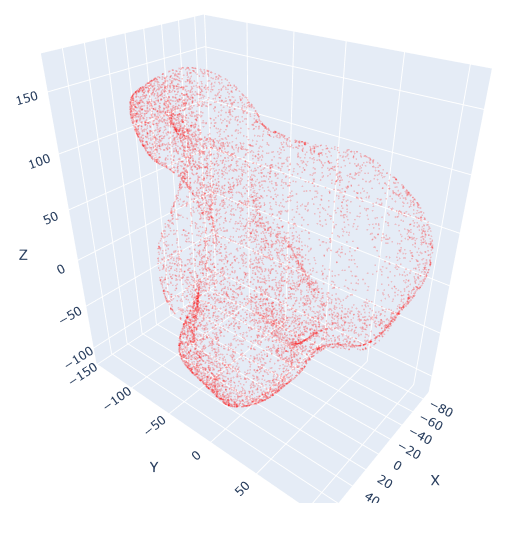

# Результаты

## Тестовые данные

Создаем набор равномерно распределенных точек на сфере, после чего
несколько раз применяем непрерывное преобразование 'force'.
Преобразование вытягивает точки в указанное направление, сила которого
зависит от степени удалённости точки от точки приложения.

## Первое облако точек

`seed = 111, n_points = 10000, force_count = 40`

На графиках представлены метрики для RANSAC и ICP алгоритмов в зависимости от угла поворота в градусах вокруг оси `z`.

Используемые метрики:

1. `rmse` - среднеквадратичное отклонение между исходными и преобразованными точками;
2. `rotation_distance` - расстояние между истинной матрицей поворота и найденной;
3. `translation_distance` - расстояние между истинным вектором сдвига и найденным.

## Второе облако точек

`seed = 23, n_points = 10000, force_count = 40`

## Выводы

1. RANSAC демонстрирует отличные результаты для данных тестов.
2. ICP находит более точное решение (с точки зрения метрики rsme), но требует более хорошего начального приближения, иначе сходится к локальному минимуму. Для данных тестов угол составляет около 50 градусов.
3. ICP работает быстрее (30 итераций), чем RANSAC (100000 итераций).
4. RANSAC и ICP лучше использовать в комбинации. RANSAC для начального приближения, ICP для уточнения результата.
